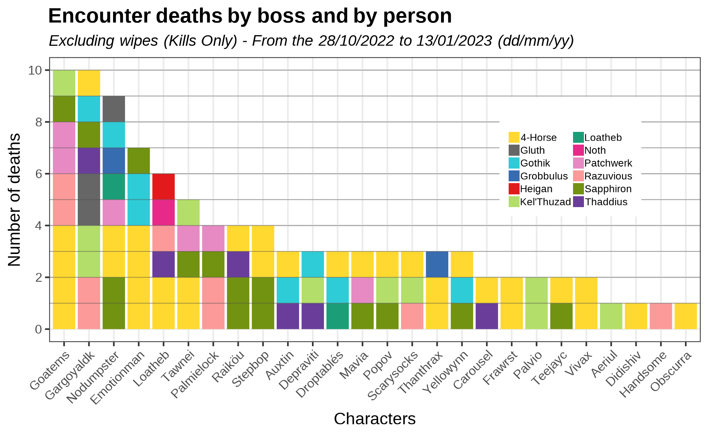
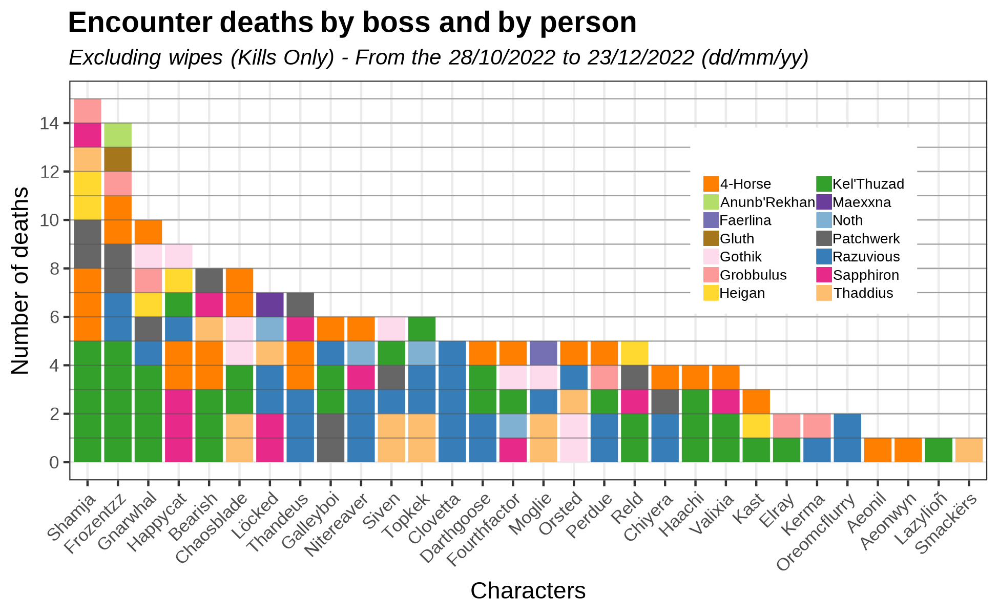
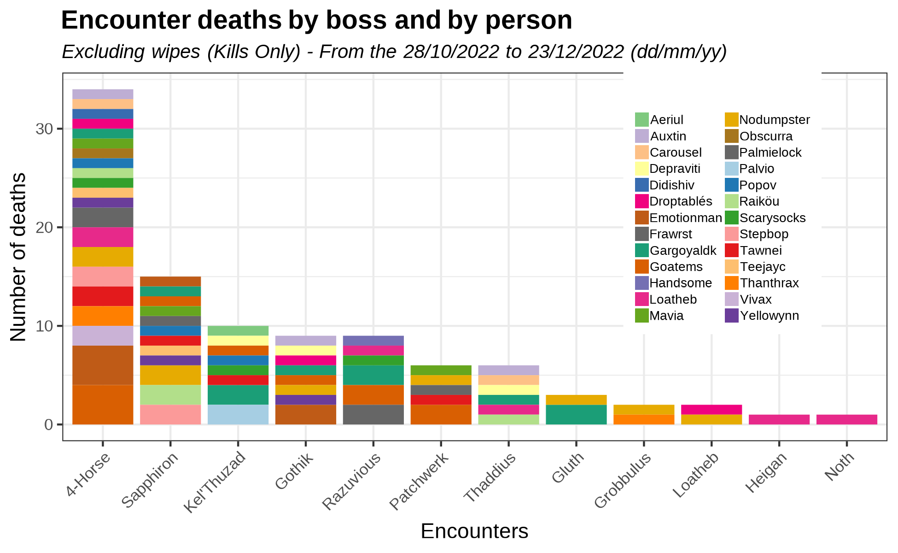
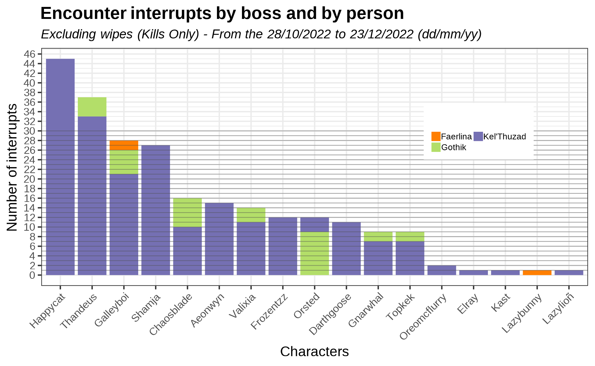
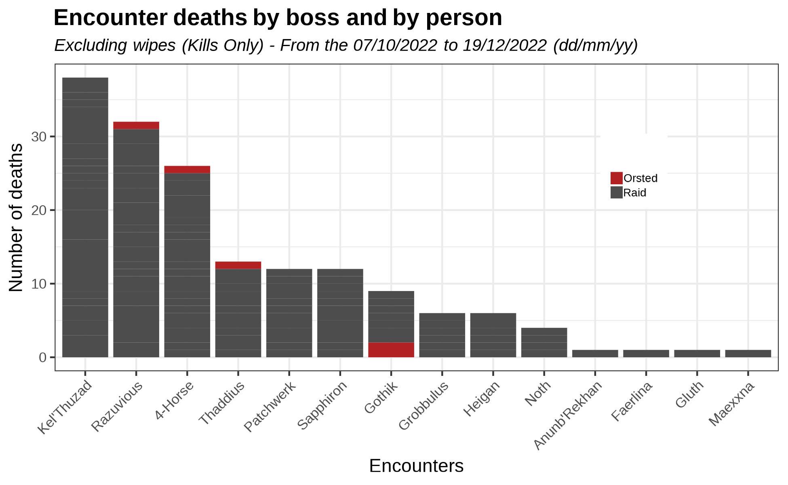
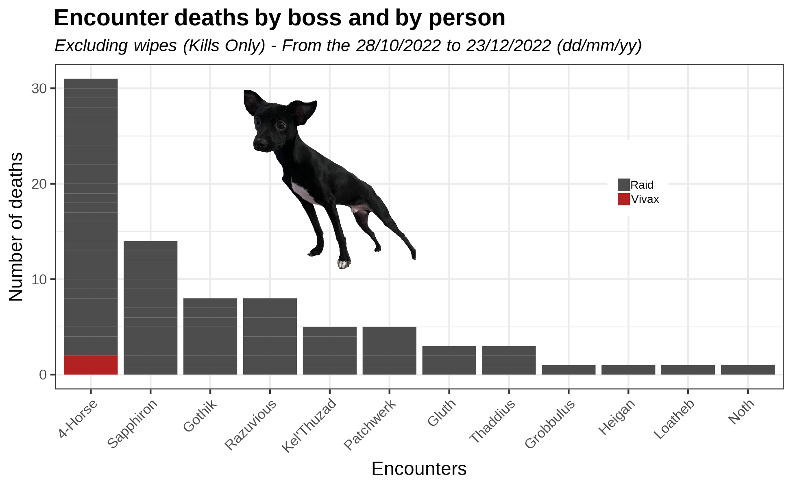

# Raid log analysis

Similar to [my analysis on mage movement data for naxx25](https://github.com/ForgeGit/naxx_mage_movement), I won't be super detailed in here because it is a project that I have on stand-by.

In the meantime, check the performance of my 2 raids as I break ethics codes by posting about my raid members without consent. 

# Table of Contents
1. [Graphic v1](#deaths-by-boss-per-person)  
2. [Graphic v1.5?](#deaths-by-person-per-boss)  
3. [Graphic v.1.a](#interrupts-per-person) 
4. [Anonymized Raid Deaths Report](#deaths-per-boss) 

## Deaths by boss per person

How many times each person died per boss (killed)

Same for different raid

## Deaths by person... per boss?

It is the same picture, but different.

## Interrupts per person

Interrupts done, per boss, per person across all kills. 

## Deaths per boss

There I was thinking "ok but how do I use this?". And I thought on a way to automatize "reporting" someones deaths, and put them in context vs the whole raid.

Lets add a dog

# Other analysis done

- Check other things I have done here: https://github.com/ForgeGit?tab=repositories

